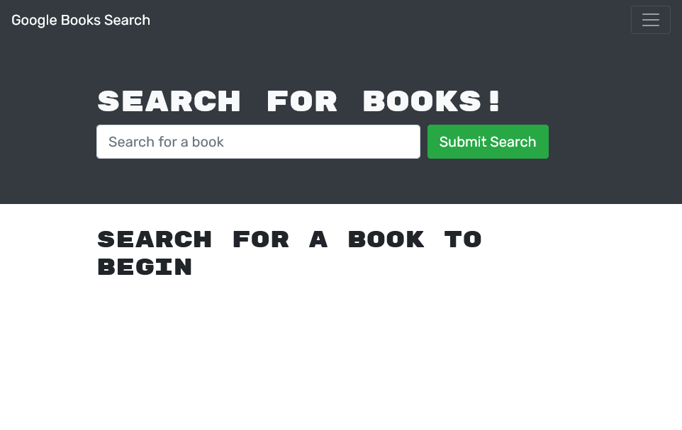
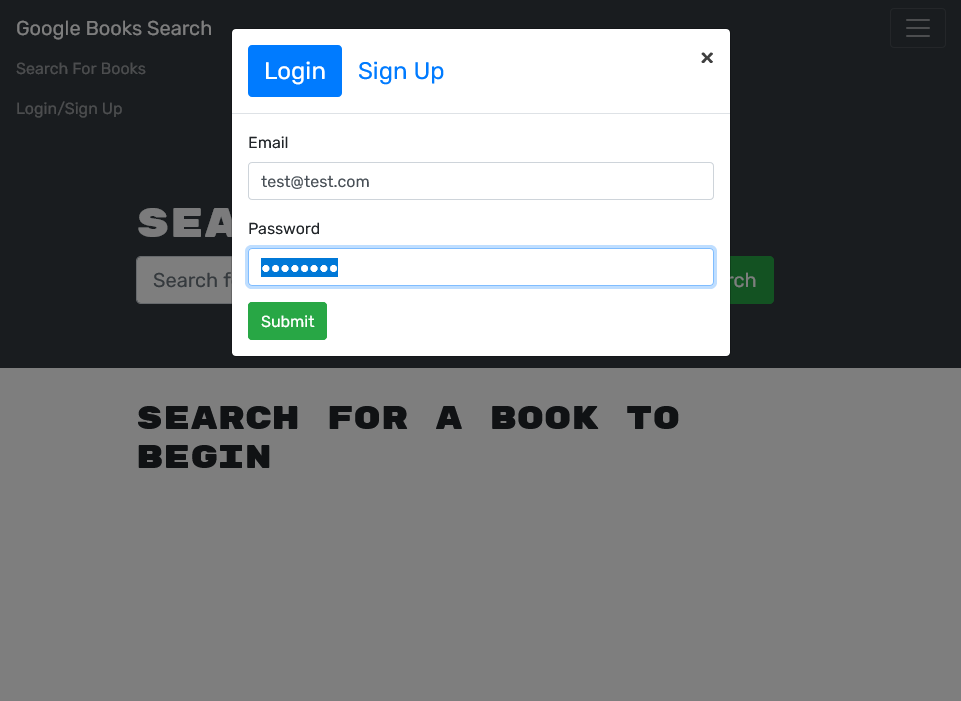
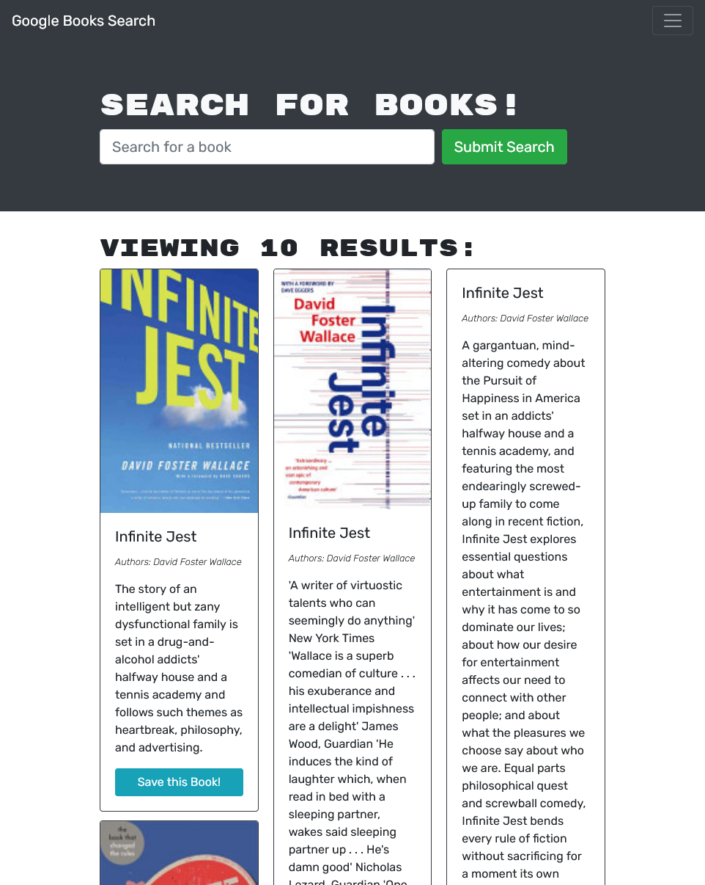
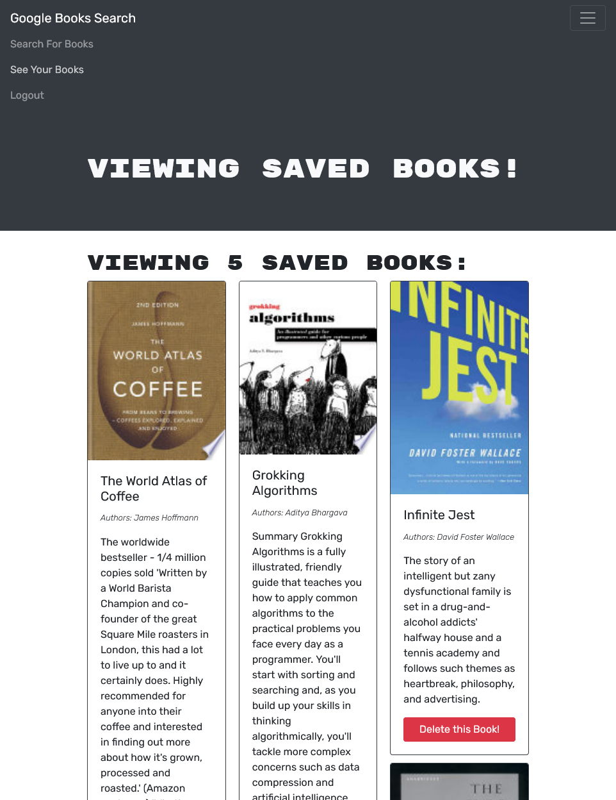

# Book Search System [](https://www.gnu.org/licenses/agpl-3.0)

## Description

A book-search app, refactored from a RESTful API to GraphQL with ApolloServer and ApolloClient  

## Contents

- [Installation](#installation)
- [Usage](#usage)
- [Questions](#questions)
- [License](#license)

## Installation

First, clone the project and install all the dependencies as follows:

```
git clone https://github.com/baker-ling/book-search-system.git
cd book-search-system
npm install
```

This app relies on MongoDB, which you can run locally or remotely. To use a remote MongoDB, create a `.env` file inside the `book-search-system` folder and add a line `MONGODB_URI=` followed by the URI for your database.

## Usage

To start the app in developer mode, run the following command in your terminal inside the app's root folder. In this mode, your computer will monitor files in the client-side and server-side folders and recompile / relaunch the server as appropriate.

```
npm run develop
```

To start the app in production mode, run the following commands in your terminal inside the app's root folder.

```
npm run build
npm run start
```

The app is currently deployed [here](https://intense-plains-21193.herokuapp.com/).

When you load the app in your browser, you will be greated with a blank welcome page inviting you to search for books.



You can log in or create an account via the hamburger menu at the top.



From there, you can search for books and add them your list from the search results.



Finally, you can review the books you saved to your book list by clicking "See Your Books" through the top nav menu. On the page showing your books, you can remove previously saved books from your list.




## Questions

If you have any questions, feel free to reach out via one of the following:

- Email: [brian.baker.bdb@gmail.com](mailto:brian.baker.bdb@gmail.com)
- Github: @baker-ling

## License

This application is distributed under the terms of [GNU Affero General Public License v3.0](./LICENSE).
